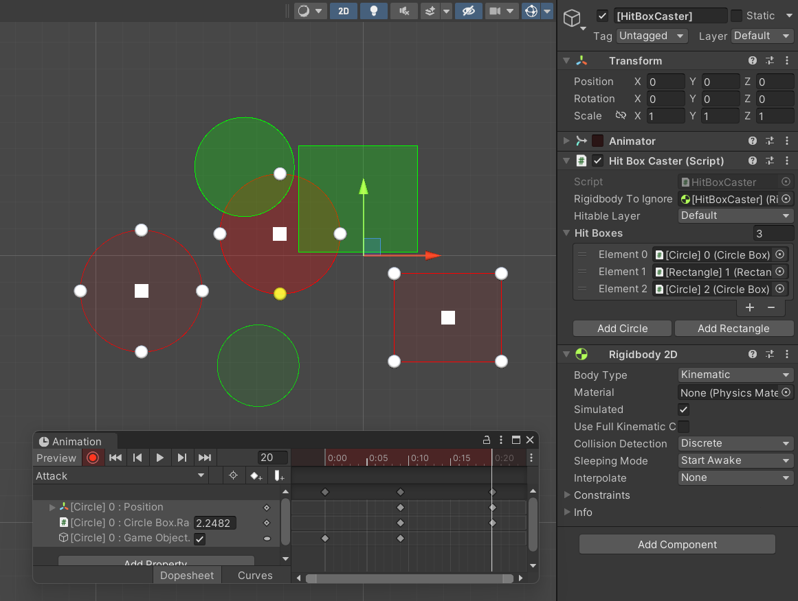
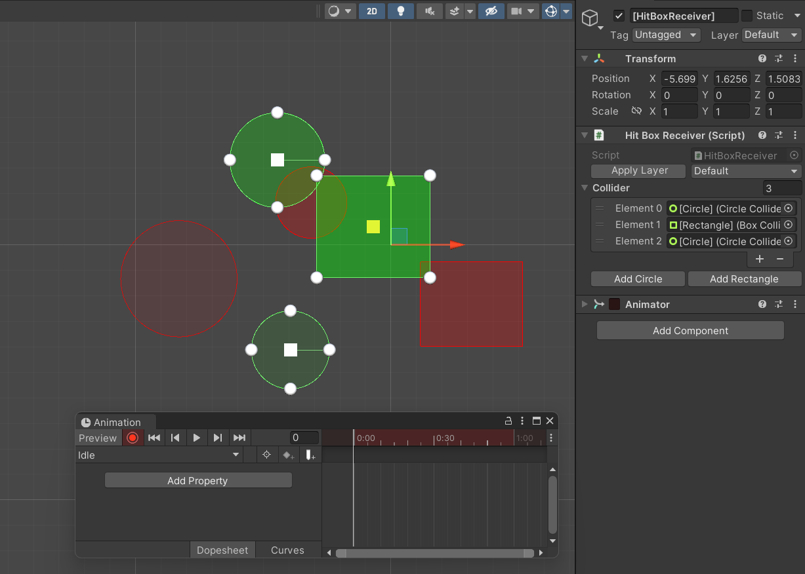

<h1 align="center">2D Hitbox System with Editor</h1>

Unity 2D Hitbox System with Editor is a flexible Hitbox system with its visualization and easy edit when animating. It uses the built in 2d Collider which makes it easily customizable. It supports circle and rectangle hitbox. It's already tested and has guaranteed hit on every frame, doesn't matter the framerate, as long as its using the physics update like using animate physics in animator.

## 👁️‍🗨️ Previews



## ✨ Features

- Easily edit hitbox when using animator.
- Has HitboxCaster and HitboxReceiver. These can be customized with using layer and collision matrix to make custom things lika shield or guard.
- Visualization with color when certain hitbox is collided.
- Guaranteed to hit a certain hitbox only once, then reset when the HitboxCaster is disabled.

## ⚙️ How To Use
- Add the HitboxCaster component and add the hitboxes.
- Add the HitboxReceiver component and add the hitboxes.
- Set the layer and collision matrix in project settings.
- Use animator to animate the children of HitboxCaster and children of HitboxReceiver.
- Disable the HitboxCaster to reset the hitbox receiver than can be hit. Usefull to make consecutive hits.
- Subscribe to the events of HitboxCaster and HitboxReceiver. You can do this with the API Reference below.


## 🔍 API Reference

### 🔗 Syntax

#### HitBoxCaster
| Event                                   | Description                        |
|:--------                                | :------------------------------    |
|`OnHitCast(HitBoxData hitboxData)`       | Event when hitbox successfully hit a HitboxReceiver. HitBoxData will contain the information like what is currently getting hit. |

#### HitBoxReceiver
| Event                                   | Description                        |
|:--------                                | :------------------------------    |
|`OnHitReceive(HitBoxData hitboxData)`    | Event when a HitboxReceiver gets hit by a HitBoxCaster. HitBoxData will contain the information like which HitBox is currently hitting. |

#### HitBoxData
| Properties            | Type       | Description                                  |
|:--------              | :--------- | :------------------------------              |
|`HitBoxCaster`         | HitBox     | The hitbox that is currently hitting.        |
|`HitColliderReceiver`  | Collider2D | The hitbox that is currently getting hit.    |


#### 📖 Examples

Subscribing to event. 
```csharp
public class Player : MonoBehaviour
{
    HitBoxCaster _caster;
    HitColliderReceiver _receiver;
    void OnEnable()
    {
        _caster.OnHitCast += ReduceEnemyHealth;
        _caster.OnHitReceive += PlayHurtAnimation;
    }
    void OnDisable()
    {
        _caster.OnHitCast -= ReduceEnemyHealth;
        _caster.OnHitReceive -= PlayHurtAnimation;
    }
    void ReduceEnemyHealth(HitBoxData hitboxData)
    {
        // Do things here.
    }
    void PlayHurtAnimation(HitBoxData hitboxData)
    {
        // Do things here.
    }
}
public class Enemy : MonoBehaviour
{
    HitBoxCaster _caster;
    HitColliderReceiver _receiver;
    void OnEnable()
    {
        _caster.OnHitCast += ReducePlayerHealth;
        _caster.OnHitReceive += PlayHurtAnimation;
    }
    void OnDisable()
    {
        _caster.OnHitCast -= ReducePlayerHealth;
        _caster.OnHitReceive -= PlayHurtAnimation;
    }
    void ReducePlayerHealth(HitBoxData hitboxData)
    {
        // Do things here.
    }
    void PlayHurtAnimation(HitBoxData hitboxData)
    {
        // Do things here.
    }
}
```

## 📝 License
[MIT](https://choosealicense.com/licenses/mit/)
